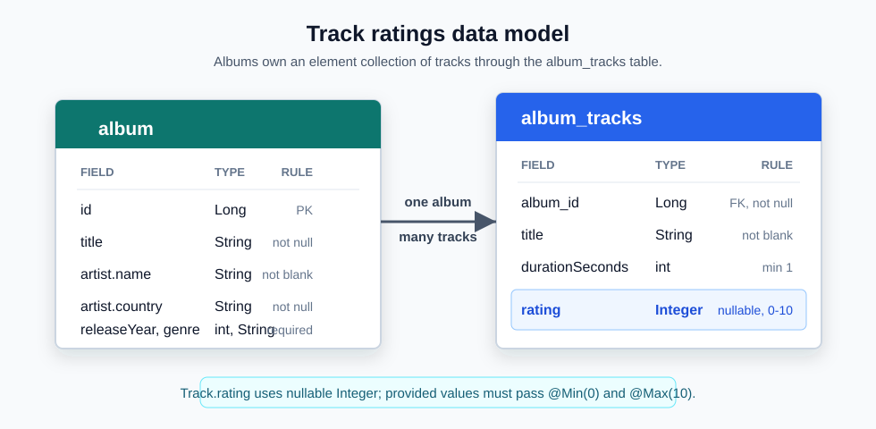

# Music Library Backend

A Java 21 Spring Boot backend used as a learning project for Codex and GitHub workflows.

The domain is a small music library: albums, artists, tracks, genres, and search.
Tracks can optionally be rated from 0 to 10.

## Data Model



Albums store their tracks in the `album_tracks` collection table. Each track can
have a nullable `rating` value, constrained from 0 to 10 when present.

## Stack

- Java 21
- Spring Boot
- Spring Web
- Spring Data JPA
- H2 in-memory database
- JUnit 5 and MockMvc
- GitHub Actions CI
- Maven installed locally

## Run

```bash
mvn spring-boot:run
```

The API starts on `http://localhost:8080`.

H2 console is available at `http://localhost:8080/h2-console`.

## Test

```bash
mvn test
```

## API

### List albums

```bash
curl http://localhost:8080/api/albums
```

Optional filters:

```bash
curl "http://localhost:8080/api/albums?artist=daft"
curl "http://localhost:8080/api/albums?genre=jazz"
```

### Get an album

```bash
curl http://localhost:8080/api/albums/1
```

### Create an album

```bash
curl -X POST http://localhost:8080/api/albums \
  -H "Content-Type: application/json" \
  -d '{
    "title": "Random Access Memories",
    "artistName": "Daft Punk",
    "artistCountry": "France",
    "releaseYear": 2013,
    "genre": "Electronic",
    "tracks": [
      { "title": "Give Life Back to Music", "durationSeconds": 275, "rating": 9 },
      { "title": "Instant Crush", "durationSeconds": 337, "rating": 10 }
    ]
  }'
```

### Update an album

```bash
curl -X PUT http://localhost:8080/api/albums/1 \
  -H "Content-Type: application/json" \
  -d '{
    "title": "Discovery",
    "artistName": "Daft Punk",
    "artistCountry": "France",
    "releaseYear": 2001,
    "genre": "Electronic",
    "tracks": [
      { "title": "One More Time", "durationSeconds": 320, "rating": 10 }
    ]
  }'
```

### Delete an album

```bash
curl -X DELETE http://localhost:8080/api/albums/1
```

## Learning Workflow With Codex

1. Open a GitHub issue using the feature or bug template.
2. Ask Codex to implement the issue.
3. Let Codex create tests and run `mvn test`.
4. Open a pull request.
5. Ask for review with `@codex review`.
6. Ask Codex to fix any high-priority finding.
7. Merge once CI and review pass.

Good first feature ideas:

- Add a rating field to albums.
- Add an endpoint for library statistics.
- Add search by track title.
- Add pagination and sorting to `GET /api/albums`.
- Replace H2 with PostgreSQL through Docker Compose.

## GitHub Setup

After the first commit, create and push the repository:

```bash
gh repo create music-library --private --source=. --remote=origin --push
```

Recommended GitHub configuration:

- Enable branch protection on `main`.
- Require the `Build and test` check before merge.
- Enable Codex code review for the repository in Codex settings.
- Add `OPENAI_API_KEY` as a repository secret only if you want to run the manual Codex Action workflow.

Two Codex paths are included:

- GitHub PR comments: use `@codex review` on a pull request.
- GitHub Actions: run the `Codex manual review` workflow from the Actions tab.
